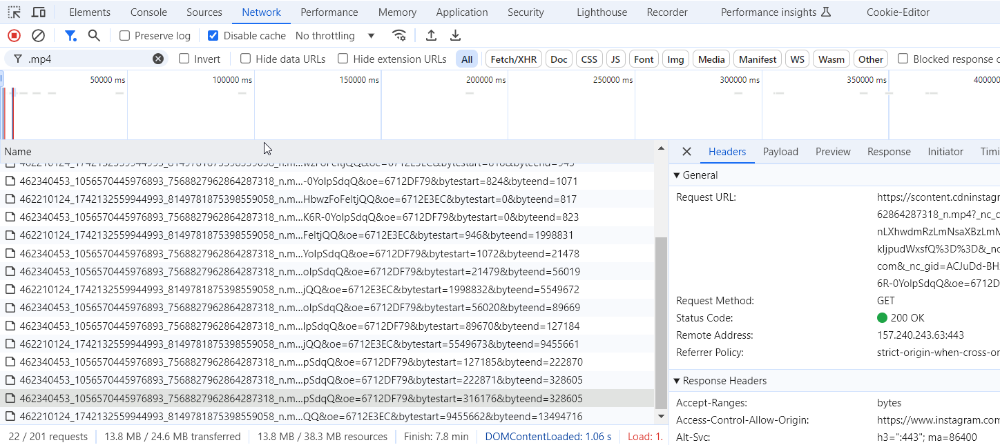

# IG Videos Downloader
Tool to download any video from Instagram using Selenium and FFmpeg

# How it works?
1. The script uses the cookies.json file to do the user authentication in the IG account (you must complete this file with your own cookies).
2. It will then access the specified URL and read the Network logs (disabling the cache).

  

3. Initially, it will download the last two logs. **How will it do it?**
- The URL obtained from the Request URL is going to be cleaned, removing the values **bytestart** and **byteend**,
- then it will then download the file using FFmpeg and specifying the Referer header.
4. If the last two logs correspond to audio and video, it will merge them, obtaining the final result.
- In case it does not correspond to audio and video, the content of the already downloaded repeated log will be deleted and the previous network log will be tried again, **until both parts are obtained**.

### ⚠️ Disclaimer: **I hate meta products btw** 😂